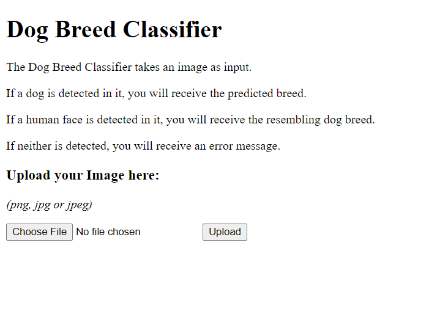

# Dog Breed Classifier

### Table of Contents

1. [Project Motivation](#project-motivation)
2. [Results](#results)
3. [Installation](#installation)
4. [File Descriptions](#file-descriptions)
5. [Licensing, Authors, and Acknowledgements](#licensing-authors-acknowledgements)

## Project Motivation
For this project I was interested in developing a classifier
which takes a picture of a dog as an input and predicts the dog's breed.
The dataset I used can be found
[here](https://drive.google.com/drive/folders/1k45XN3L9dHUp9ypm2_KpWidBIWqIKuoN?usp=sharing).
Overall, it contains 8351 images of dogs categorized in 133 categories/breeds.

To develop the classifier I experimented with two different approaches:
1. Training from Scratch (see [from_scratch.pdf](./docs/from_scratch.pdf))
2. Using Transfer Learning (see [transfer_learning.pdf](./docs/transfer_learning.pdf))

Besides the model development, I wanted to package this project in a web app
so that a user can easily use the trained classifiers.
Therefore, I built a flask web around it where users can upload their files
and receive the classifiers' predictions.

Moreover, a dog detector and a human face detector are included in the web app.
The dog detector to detect whether an uploaded picture contains a dog.
The human face detector to detect whether an uploaded picture contains a human face or not.
The latter is kind of a gimmick,
as the dog breed detector will predict the resembling dog breed for the image of a human face if one was detected.
If neither dog or human were detected, the classifier is not called.
Instead a corresponding error message is returned.

## Results

The results I got with training models from scratch were not very promising.
But this was to be expected as 8351 images (for training, validation and test)
are a very small dataset to learn 133 categories from.
The small model (28,037 parameters) I ended up with achieved ~2% accuracy on the test set after 12 epochs.
This is far better than guessing the breed randomly (1/133 = ~0,75% accuracy) but still leaves much to be desired.
Nevertheless, it is very probable that a larger network, more epochs and data augmentation would lead to better results
when training a model from scratch (but that would also need a lot of time and computing power).  
Also see: [from_scratch.pdf](./docs/from_scratch.pdf)

In the end I achieved **~70% accuracy** with a transfer learning approach.
I do not believe this result could ever be beaten
by the learning from scratch approach with that little data. 
Transfer learning really showed its advantages here
as the weights of the
[InceptionV3](https://keras.io/api/applications/inceptionv3/)
network learned on the imagenet dataset
could easily be used to achieve very impressive results on our related dog breed classification problem.  
Also see: [transfer_learning.pdf](./docs/transfer_learning.pdf).

Dog detection and human face detection were implemented just using pretrained standard models from
keras (see [dog_detection.py](./dog_breed_classifier/detection/dog_detection.py))
and cv2 (see [face_detection.py](./dog_breed_classifier/detection/face_detection.py)).

The created web app consists of two pages:  
- One to upload the image to be classified `/`:  
  

- another to see the classification result `/result/<image-file-name>`:  
 

## Installation

### Requirements
The code should run with no issues using Python version `3.7`.
To use it with versions `>3.7`, at least, you would have to change the used tensorflow version to `>=2.2`.  

As the code in this repository uses convolutional neural networks (CNNs),
powerful GPUs will make it run significantly faster but are not necessary
(GPUs should be auto-detected by the used `tensorflow` package).  

To run the training scripts you should have `>=16GB RAM` available on your machine.

### Setup
First you should download the data used for model training, validation and evaluation from
[here](https://drive.google.com/drive/folders/1k45XN3L9dHUp9ypm2_KpWidBIWqIKuoN?usp=sharing).  
It contains a `dog_images` folder which should be placed under
`dog_breed_classifier/detection/training/data`.  
It is also used as the source for the predicted category/breed names. 

To install the project run:  
`./scripts/<op>/prepare_env.<filetype>`  
where `<op>` is either `ubuntu` or `win`  
and `<filetype>` is either `sh` or `bat`  
depending on your operating system (also for windows you will have to use backslashes for your paths) .

As a result you will have the `dog_breed_classifier` package installed in your `venv`
and should already be able to run:  
`./scripts/<op>/run.<filetype>`

The `run` script will start a Flask web app available for you under `http://localhost:5000/`.  
You should see the upload page shown in the image above in the [results section](#results).  

### Data
The dataset you downloaded in the first [setup](#setup) step contains 8351 images of dogs categorized in 133 breeds.
6680 images are in the training set,
835 images in the validation set
and 836 images in the test set.

### Models
Per default the model included in the repo under:  
`./dog_breed_classifier/detection/training/models/from_scratch/from_scratch_model.hdf5`  
will be used to predict dog breeds.
It was trained from scratch and has an accuracy of ~2% for 133 classes.

You will probably want to use a better model which uses transfer learning.
The model I created achieves an accuracy of ~70%.
You can obtain it either by downloading it from
[here](https://drive.google.com/drive/folders/1ysjXHqWgbbVsPny4DTWC6gf1vs5LU5aR?usp=sharing)
or by training it yourself via running the
`./dog_breed_classifier/detection/training/transfer_learning.py`
script (this might take some time without a GPU).

Either way, if you want to use the transfer learning model
it should be placed under:  
`./dog_breed_classifier/detection/training/models/transfer_learning/transfer_learning_model.hdf5`

## File Descriptions

`/docs`: Contains additional documentation for this project.
Mainly focuses on the classifier training approaches I experimented with.

`/dog_breed_classifier/app`: Contains the flask related webapp portion of the project.  

`/dog_breed_classifier/detection`: Contains all classifier related portions of the project.  
`/dog_breed_classifier/detection/training`: Contains everything related to the training of models.  

`/dog_breed_classifier/paths.py`: Transparently shows all paths used within the code of the project.

`/scripts`: Contains scripts to set up and run the project.  

`/.gitignore`: Defines files to be ignored by git.  
`/LICENSE`: Licensing information of the project.  
`/README.md`: This file.  
`/requirements.txt`: Defines the required python packages.  
`/setup.py`: Defines the python package for this project.

## Licensing, Authors, Acknowledgements
I obtained the data used to train, validate and evaluate the dog breed classifier
(8531 dog images sorted into 133 categories) as part of the Udacity data scientist nanodegree program.
Thanks for that!

Feel free to use the code here as you would like!
